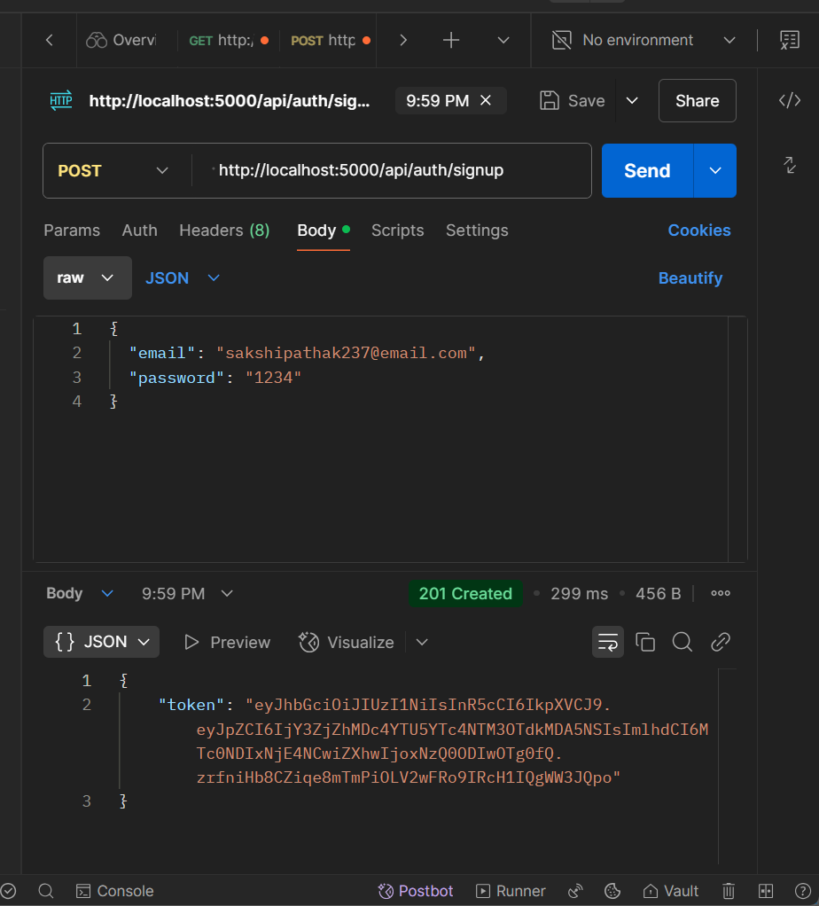
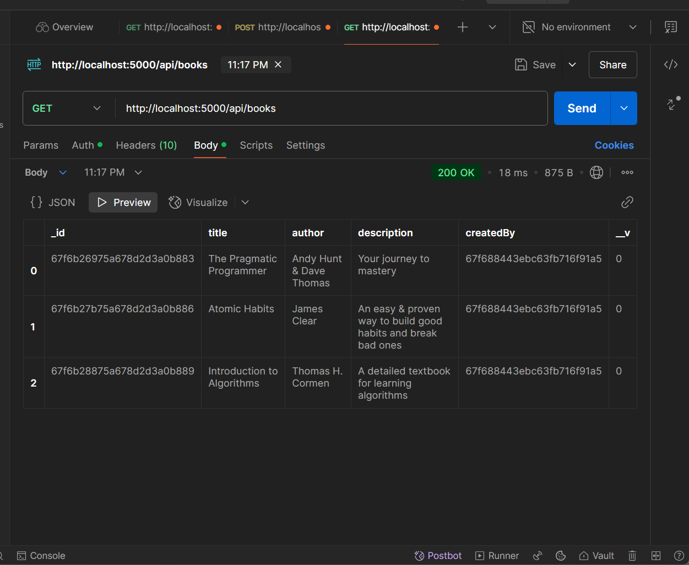
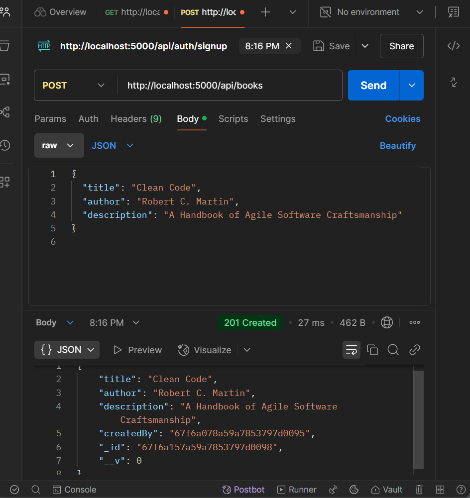
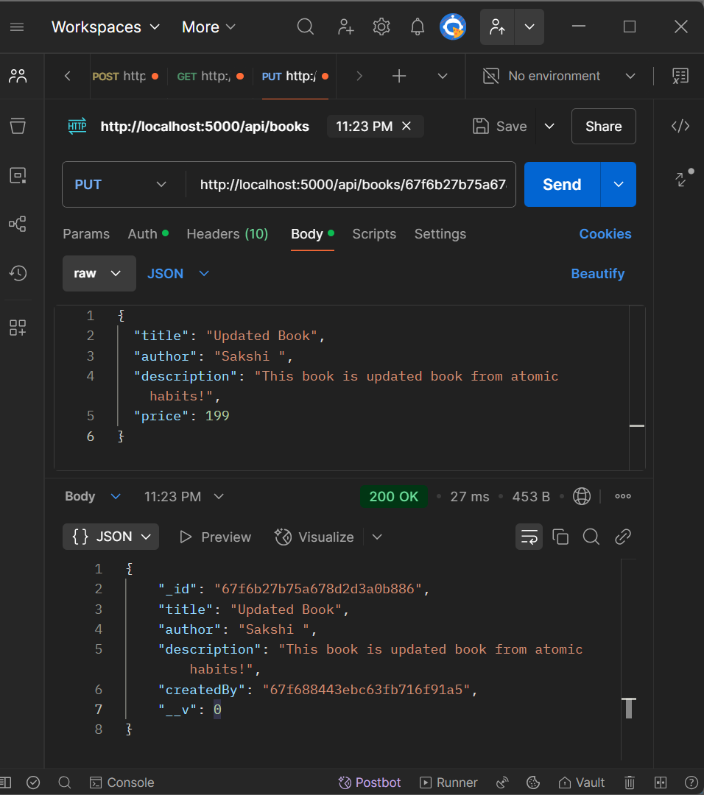
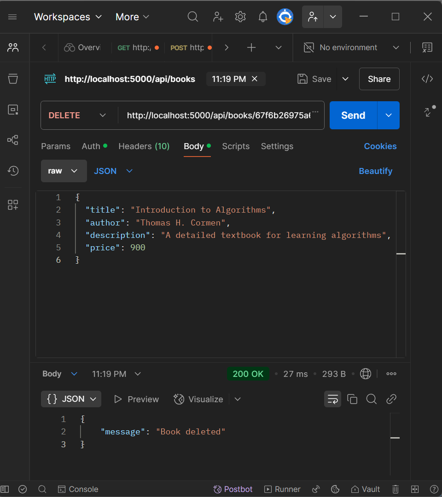

#  Bookstore REST API

A secure and tested backend API for a full-fledged Bookstore application, built with **Node.js**, **Express**, and **MongoDB**, using **JWT authentication** for protected routes. All endpoints have been tested and validated using **Postman**.

---

## 🚀 Tech Stack

- **Node.js + Express**
- **MongoDB + Mongoose**
- **JWT** for user authentication
- **Postman** for testing

---

## 🔐 Authentication Features

- `POST /api/auth/signup` – Register a new user  
- `POST /api/auth/login` – Login and receive a JWT token  

> 📌 Token is required in the `Authorization` header for protected routes

---

## 📖 Book Routes (Protected)

| Method | Route              | Description        |
|--------|-------------------|--------------------|
| GET    | `/api/books`       | Get all books      |
| POST   | `/api/books`       | Add a new book     |
| PUT    | `/api/books/:id`   | Update book by ID  |
| DELETE | `/api/books/:id`   | Delete book by ID  |

> ⚠️ All book routes require a valid token.

---

## 🛠 How to Test

1. **Start the server**

   ```bash
   npm install
   npm run dev

2. **Use Postman to test endpoints**

First, sign up and log in to get a token

Use the token in the Authorization tab → Type: Bearer Token

Then test book CRUD operations


---

## ✅ CRUD Operations (Tested in Postman)

Below are the screenshots of each CRUD operation tested via Postman.

---

### 📝 Signup  
`POST /api/auth/signup`  


---


### 📚 Get All Books  
`GET /api/books`  


---

### ➕ Add a Book  
`POST /api/books`  


---

### 🧼 Update a Book  
`PUT /api/books/:id`  
> Make sure to pass the book ID and update fields in the body.  


---

### 🗑️ Delete a Book  
`DELETE /api/books/:id`  
> Pass the correct book ID in the route.  



